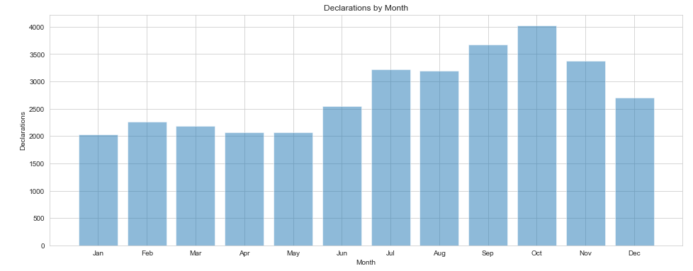
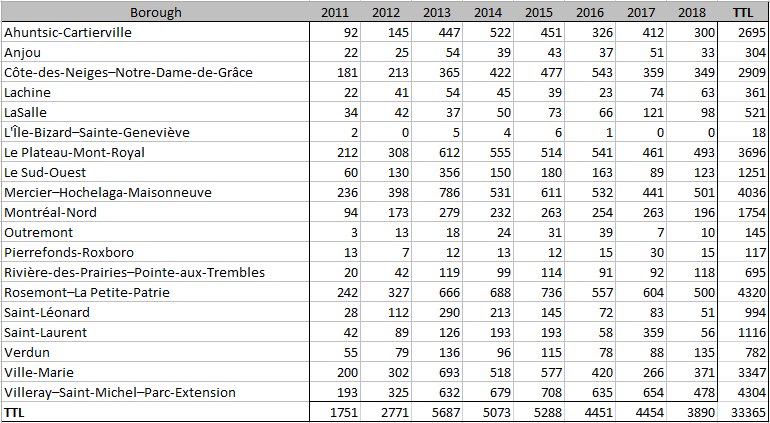
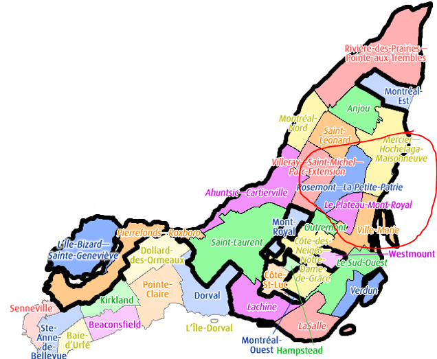

# Deadline: May 11th - Data Blog

#### Descriptive

 

The data chart above gives us a glimpse into the breakdown of declarations made through the city since they began tracking this information in July 2011.  We can see that the top 5 months for declarations are between the periods of July and November.  During this part of the year, there were over 3000 declarations registered per month.  After a peak in the month of October of 4022, it declines by 16% in November to 3379 and from October to December we see a decrease of 33%.  The largest decrease can be found between the months of October and January at 50.5%.  
The lowest number of cases can be found between the period of December to May with January, April and May totaling the least.  After a low in May, we can see a surge going into the summer period with increases between May to June and June to July of 23% and 26% respectively giving us an augmentation of reported cases from May to July of 55.5%.

As we can see in the chart, there seems to be a positive correlation between the change in weather and an increase in declarations.

The chart above identifies the declarations by borough on a yearly basis.  We can see based on the figures that the boroughs of Rosemont-La Petite Patrie, Villeray-Saint-Michel-Parc-Extension, Mercier-Hochelaga-Maisonneuve, Le Plateau Mont-Royal and Ville-Marie account for 4320, 4304, 4036, 3696 and 3347 respectively.  These 5 boroughs out of the reported 19 account for 59% of the declared infestations over the period 2011-2018 and led the way with declarations in 2018.  The largest increase in number of declarations based on volume for 2018 are Verdun (53%), Ville-Marie (39.5%), Sud-Ouest (38%) and Rivière-des-Prairies–Pointe-aux-Trembles (28%) and Mercier-Hochelaga-Maisonneuve (13.6%).  The remaining are very low volumes or a decrease from the previous year.  A borough to gather more insight on would be Saint-Laurent.  We see during the last 3 years a decline of 70%, increase of 518% and decline of 84%.

 [3]

As you can see above, the top 5 boroughs, in terms of reported declarations share the same borders.

#### Diagnostics

The data encompasses all official declarations made to the city associated to an extermination. As specified on the city dataset site, any declaration that is not associated to an extermination has been removed from the dataset. Those entries account for 7% of the declarations and would translate to approximately 2335 declarations [2].  Also, there is no guarantee that all infestations within each borough was reported so the possibility exists that besides the removed declarations other undeclared/uninspected homes existed within any given year which would raise the totals.

As we have seen with the monthly breakdown chart, the volume of reported cases is higher between June and November. What can be some causes? Better weather gets more people out, interacting and moving around enabling bedbugs more carriers to allow them to move from place to place. This period also coincides with moving season in which people rid themselves of unwanted furniture which can make their way back into another home.  Based on government documentation, 2 of the methods for removal of bedbugs are through heat or cold treatments.  Keeping them in -18 degrees Celsius for a minimum of 84 hours or heat above 48 degrees for a certain amount of time dependent on the affected area/item/object [1]. The 18 degrees below Celsius is a great indicator of why the declarations are reduced during the winter period. They would not survive outdoors for a prolonged period of time and are restricted to remaining indoors curtailing the spread during this period.

Based on our descriptive analysis, the St-Laurent borough would be a place to investigate further.  While looking at the chart by year, we must ask ourselves the question “Why was there such sharp changes within a 3-year period?”.  There were decreases of 70% and 84% and in between an increase of 518% for the years 2016 - 2018.  Can the changes be attributed to clerical error or an actual problem that flared up, was controlled and resolved?

Another question to ask ourselves based on this data, why the same boroughs consistently appear within the top 5 for declarations?  Condition/age of the homes, socio-economic factors, population density…?

References:
[1] (http://www.environnement.gouv.qc.ca/pesticides/permis-en/code-gestion-en/BedBugControl.pdf)

[2] (http://donnees.ville.montreal.qc.ca/dataset/declarations-exterminations-punaises-de-lit)

[3] (https://en.wikipedia.org/wiki/Boroughs_of_Montreal)
